# bIRC Vim colorscheme adaptations

This catalog adapts popular and historically notable Vim and Neovim color
schemes to bIRC's exported JSON format. Each subdirectory contains one JSON
file and a README linking to the canonical upstream theme whenever possible.

The catalog covers classic Vim.org leaders, themes identified by Vim's own
colorscheme project as historically prominent, and broadly installed modern
Neovim themes. Popularity changes over time, so this is intentionally broad
but cannot be mathematically exhaustive.

Selection evidence:

- [Vim's colorscheme project](https://github.com/vim/colorschemes) identifies
  Monokai, Solarized, Gruvbox, Jellybeans, and Mustang-era themes as
  historically prominent.
- [Vim.org's rated colorscheme catalog](https://www.vim.org/scripts/script_search_results.php?order_by=rating&script_type=color+scheme&show_me=1000)
  supplies long-running download and rating evidence.
- [Dotfyle's current installation ranking](https://dotfyle.com/neovim/colorscheme/top)
  supplies modern Neovim usage evidence.

## Import files

The previews approximate a small bIRC conversation using each JSON palette.
Actual typography and interface layout remain controlled by bIRC.

<table><tr>
<td width="50%" valign="top">
<a href="solarized-dark/README.md"><strong>Solarized Dark</strong></a> 
<a href="solarized-dark/solarized-dark.json">JSON</a> 
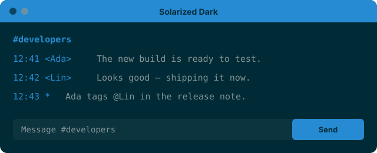
</td>
<td width="50%" valign="top">
<a href="solarized-light/README.md"><strong>Solarized Light</strong></a> 
<a href="solarized-light/solarized-light.json">JSON</a> 

</td>
</tr></table>
<table><tr>
<td width="50%" valign="top">
<a href="gruvbox-dark/README.md"><strong>Gruvbox Dark</strong></a> 
<a href="gruvbox-dark/gruvbox-dark.json">JSON</a> 

</td>
<td width="50%" valign="top">
<a href="gruvbox-light/README.md"><strong>Gruvbox Light</strong></a> 
<a href="gruvbox-light/gruvbox-light.json">JSON</a> 

</td>
</tr></table>
<table><tr>
<td width="50%" valign="top">
<a href="molokai/README.md"><strong>Molokai</strong></a> 
<a href="molokai/molokai.json">JSON</a> 

</td>
<td width="50%" valign="top">
<a href="zenburn/README.md"><strong>Zenburn</strong></a> 
<a href="zenburn/zenburn.json">JSON</a> 

</td>
</tr></table>
<table><tr>
<td width="50%" valign="top">
<a href="jellybeans/README.md"><strong>Jellybeans</strong></a> 
<a href="jellybeans/jellybeans.json">JSON</a> 

</td>
<td width="50%" valign="top">
<a href="vividchalk/README.md"><strong>Vividchalk</strong></a> 
<a href="vividchalk/vividchalk.json">JSON</a> 

</td>
</tr></table>
<table><tr>
<td width="50%" valign="top">
<a href="papercolor-dark/README.md"><strong>PaperColor Dark</strong></a> 
<a href="papercolor-dark/papercolor-dark.json">JSON</a> 
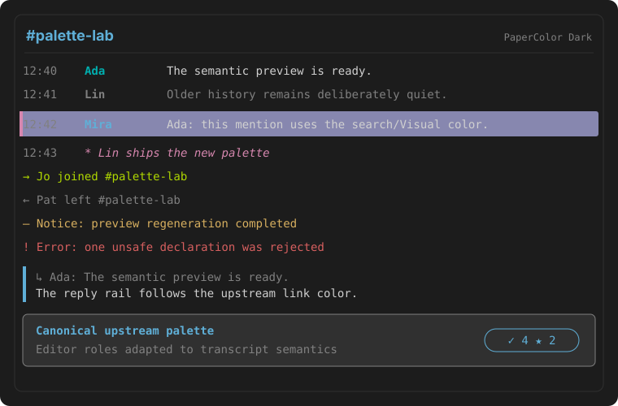
</td>
<td width="50%" valign="top">
<a href="papercolor-light/README.md"><strong>PaperColor Light</strong></a> 
<a href="papercolor-light/papercolor-light.json">JSON</a> 

</td>
</tr></table>
<table><tr>
<td width="50%" valign="top">
<a href="onedark/README.md"><strong>OneDark</strong></a> 
<a href="onedark/onedark.json">JSON</a> 

</td>
<td width="50%" valign="top">
<a href="one-light/README.md"><strong>One Light</strong></a> 
<a href="one-light/one-light.json">JSON</a> 
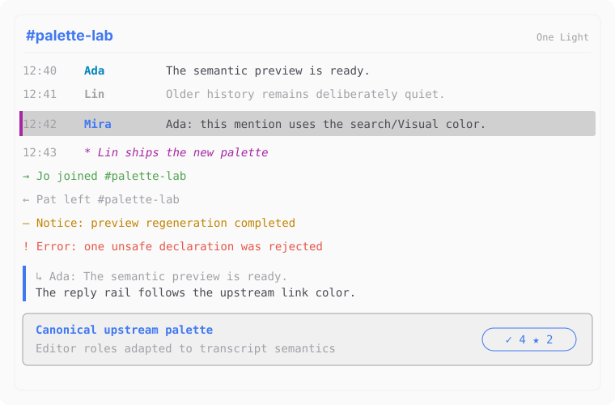
</td>
</tr></table>
<table><tr>
<td width="50%" valign="top">
<a href="nord/README.md"><strong>Nord</strong></a> 
<a href="nord/nord.json">JSON</a> 

</td>
<td width="50%" valign="top">
<a href="dracula/README.md"><strong>Dracula</strong></a> 
<a href="dracula/dracula.json">JSON</a> 

</td>
</tr></table>
<table><tr>
<td width="50%" valign="top">
<a href="monokai/README.md"><strong>Monokai</strong></a> 
<a href="monokai/monokai.json">JSON</a> 

</td>
<td width="50%" valign="top">
<a href="ayu-dark/README.md"><strong>Ayu Dark</strong></a> 
<a href="ayu-dark/ayu-dark.json">JSON</a> 

</td>
</tr></table>
<table><tr>
<td width="50%" valign="top">
<a href="ayu-mirage/README.md"><strong>Ayu Mirage</strong></a> 
<a href="ayu-mirage/ayu-mirage.json">JSON</a> 
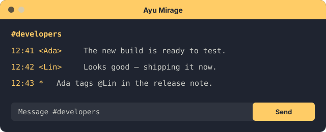
</td>
<td width="50%" valign="top">
<a href="ayu-light/README.md"><strong>Ayu Light</strong></a> 
<a href="ayu-light/ayu-light.json">JSON</a> 

</td>
</tr></table>
<table><tr>
<td width="50%" valign="top">
<a href="oceanic-next/README.md"><strong>Oceanic Next</strong></a> 
<a href="oceanic-next/oceanic-next.json">JSON</a> 

</td>
<td width="50%" valign="top">
<a href="hybrid/README.md"><strong>Hybrid</strong></a> 
<a href="hybrid/hybrid.json">JSON</a> 

</td>
</tr></table>
<table><tr>
<td width="50%" valign="top">
<a href="iceberg/README.md"><strong>Iceberg</strong></a> 
<a href="iceberg/iceberg.json">JSON</a> 
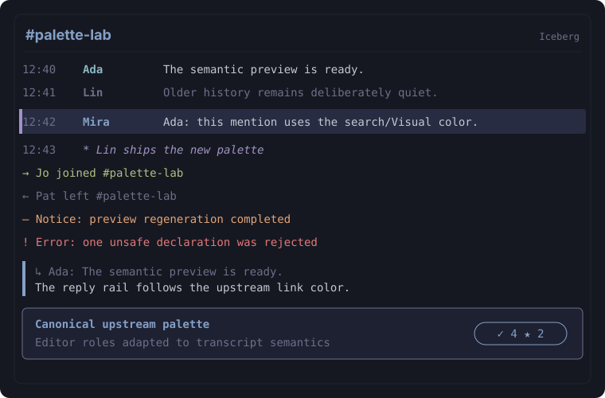
</td>
<td width="50%" valign="top">
<a href="palenight/README.md"><strong>Palenight</strong></a> 
<a href="palenight/palenight.json">JSON</a> 
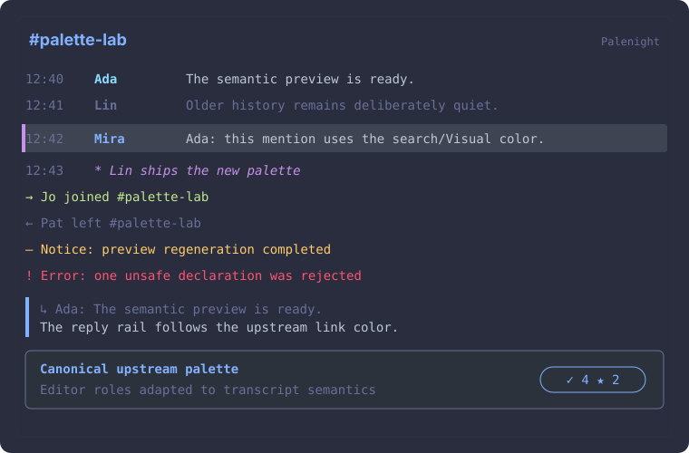
</td>
</tr></table>
<table><tr>
<td width="50%" valign="top">
<a href="tender/README.md"><strong>Tender</strong></a> 
<a href="tender/tender.json">JSON</a> 

</td>
<td width="50%" valign="top">
<a href="gotham/README.md"><strong>Gotham</strong></a> 
<a href="gotham/gotham.json">JSON</a> 

</td>
</tr></table>
<table><tr>
<td width="50%" valign="top">
<a href="seoul256/README.md"><strong>Seoul256</strong></a> 
<a href="seoul256/seoul256.json">JSON</a> 

</td>
<td width="50%" valign="top">
<a href="wombat/README.md"><strong>Wombat</strong></a> 
<a href="wombat/wombat.json">JSON</a> 

</td>
</tr></table>
<table><tr>
<td width="50%" valign="top">
<a href="desert/README.md"><strong>Desert</strong></a> 
<a href="desert/desert.json">JSON</a> 

</td>
<td width="50%" valign="top">
<a href="elflord/README.md"><strong>Elflord</strong></a> 
<a href="elflord/elflord.json">JSON</a> 
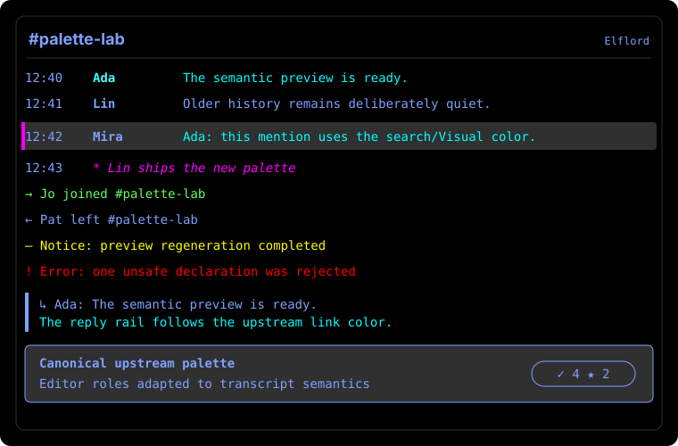
</td>
</tr></table>
<table><tr>
<td width="50%" valign="top">
<a href="morning/README.md"><strong>Morning</strong></a> 
<a href="morning/morning.json">JSON</a> 

</td>
<td width="50%" valign="top">
<a href="catppuccin-mocha/README.md"><strong>Catppuccin Mocha</strong></a> 
<a href="catppuccin-mocha/catppuccin-mocha.json">JSON</a> 

</td>
</tr></table>
<table><tr>
<td width="50%" valign="top">
<a href="catppuccin-macchiato/README.md"><strong>Catppuccin Macchiato</strong></a> 
<a href="catppuccin-macchiato/catppuccin-macchiato.json">JSON</a> 
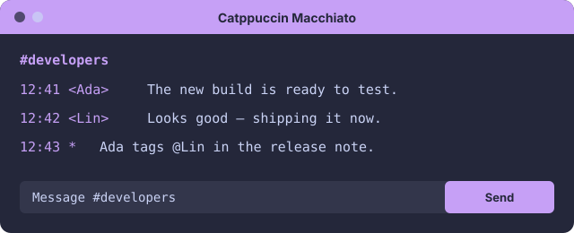
</td>
<td width="50%" valign="top">
<a href="catppuccin-frappe/README.md"><strong>Catppuccin Frappé</strong></a> 
<a href="catppuccin-frappe/catppuccin-frappe.json">JSON</a> 

</td>
</tr></table>
<table><tr>
<td width="50%" valign="top">
<a href="catppuccin-latte/README.md"><strong>Catppuccin Latte</strong></a> 
<a href="catppuccin-latte/catppuccin-latte.json">JSON</a> 
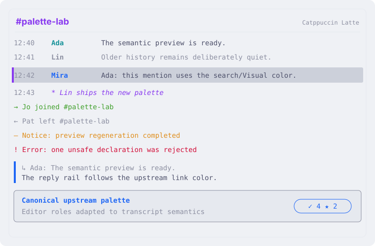
</td>
<td width="50%" valign="top">
<a href="tokyonight-night/README.md"><strong>Tokyo Night</strong></a> 
<a href="tokyonight-night/tokyonight-night.json">JSON</a> 

</td>
</tr></table>
<table><tr>
<td width="50%" valign="top">
<a href="tokyonight-storm/README.md"><strong>Tokyo Night Storm</strong></a> 
<a href="tokyonight-storm/tokyonight-storm.json">JSON</a> 

</td>
<td width="50%" valign="top">
<a href="tokyonight-moon/README.md"><strong>Tokyo Night Moon</strong></a> 
<a href="tokyonight-moon/tokyonight-moon.json">JSON</a> 
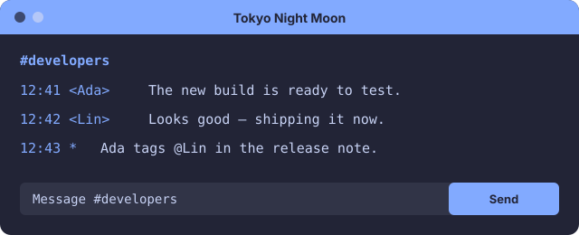
</td>
</tr></table>
<table><tr>
<td width="50%" valign="top">
<a href="tokyonight-day/README.md"><strong>Tokyo Night Day</strong></a> 
<a href="tokyonight-day/tokyonight-day.json">JSON</a> 
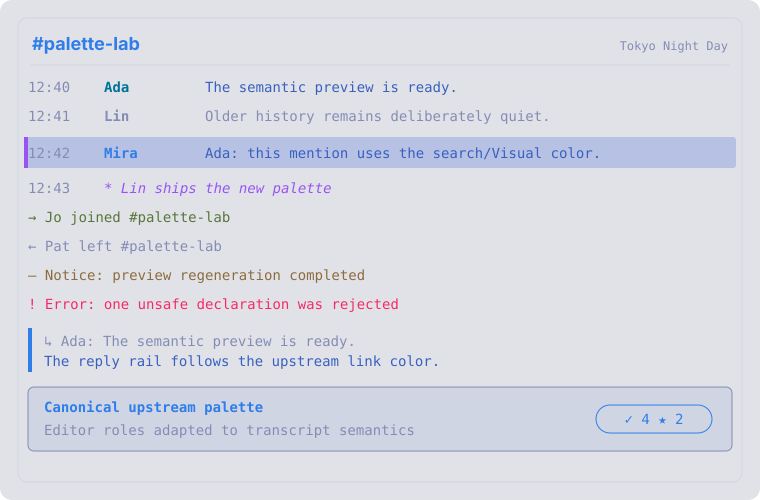
</td>
<td width="50%" valign="top">
<a href="kanagawa-wave/README.md"><strong>Kanagawa Wave</strong></a> 
<a href="kanagawa-wave/kanagawa-wave.json">JSON</a> 

</td>
</tr></table>
<table><tr>
<td width="50%" valign="top">
<a href="kanagawa-dragon/README.md"><strong>Kanagawa Dragon</strong></a> 
<a href="kanagawa-dragon/kanagawa-dragon.json">JSON</a> 
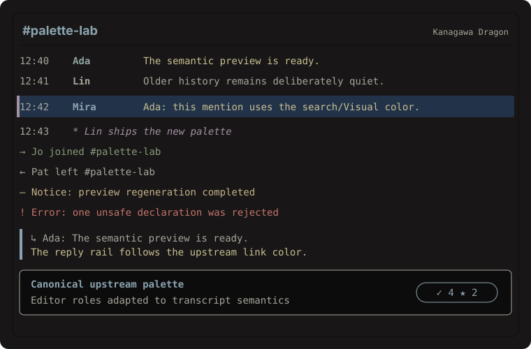
</td>
<td width="50%" valign="top">
<a href="kanagawa-lotus/README.md"><strong>Kanagawa Lotus</strong></a> 
<a href="kanagawa-lotus/kanagawa-lotus.json">JSON</a> 

</td>
</tr></table>
<table><tr>
<td width="50%" valign="top">
<a href="rose-pine/README.md"><strong>Rosé Pine</strong></a> 
<a href="rose-pine/rose-pine.json">JSON</a> 

</td>
<td width="50%" valign="top">
<a href="rose-pine-moon/README.md"><strong>Rosé Pine Moon</strong></a> 
<a href="rose-pine-moon/rose-pine-moon.json">JSON</a> 
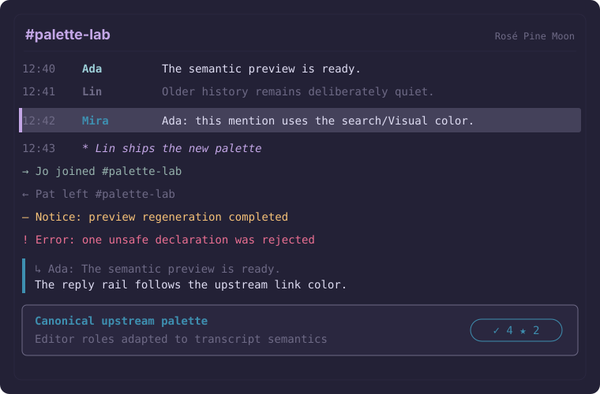
</td>
</tr></table>
<table><tr>
<td width="50%" valign="top">
<a href="rose-pine-dawn/README.md"><strong>Rosé Pine Dawn</strong></a> 
<a href="rose-pine-dawn/rose-pine-dawn.json">JSON</a> 
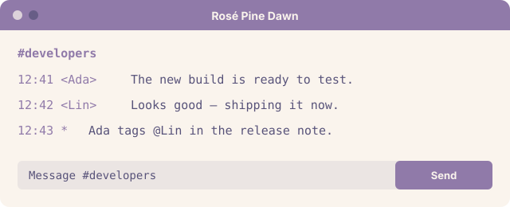
</td>
<td width="50%" valign="top">
<a href="nightfox/README.md"><strong>Nightfox</strong></a> 
<a href="nightfox/nightfox.json">JSON</a> 

</td>
</tr></table>
<table><tr>
<td width="50%" valign="top">
<a href="dayfox/README.md"><strong>Dayfox</strong></a> 
<a href="dayfox/dayfox.json">JSON</a> 

</td>
<td width="50%" valign="top">
<a href="dawnfox/README.md"><strong>Dawnfox</strong></a> 
<a href="dawnfox/dawnfox.json">JSON</a> 
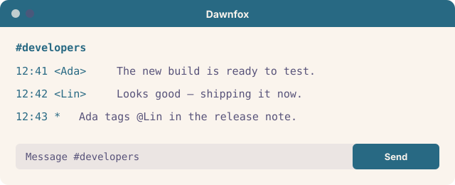
</td>
</tr></table>
<table><tr>
<td width="50%" valign="top">
<a href="duskfox/README.md"><strong>Duskfox</strong></a> 
<a href="duskfox/duskfox.json">JSON</a> 
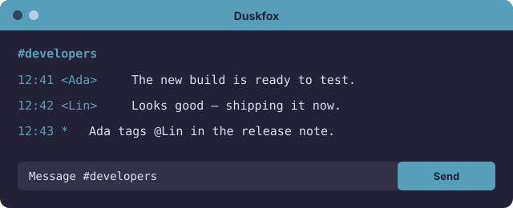
</td>
<td width="50%" valign="top">
<a href="nordfox/README.md"><strong>Nordfox</strong></a> 
<a href="nordfox/nordfox.json">JSON</a> 

</td>
</tr></table>
<table><tr>
<td width="50%" valign="top">
<a href="terafox/README.md"><strong>Terafox</strong></a> 
<a href="terafox/terafox.json">JSON</a> 

</td>
<td width="50%" valign="top">
<a href="carbonfox/README.md"><strong>Carbonfox</strong></a> 
<a href="carbonfox/carbonfox.json">JSON</a> 
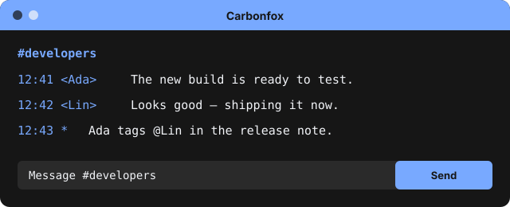
</td>
</tr></table>
<table><tr>
<td width="50%" valign="top">
<a href="everforest-dark/README.md"><strong>Everforest Dark</strong></a> 
<a href="everforest-dark/everforest-dark.json">JSON</a> 

</td>
<td width="50%" valign="top">
<a href="everforest-light/README.md"><strong>Everforest Light</strong></a> 
<a href="everforest-light/everforest-light.json">JSON</a> 

</td>
</tr></table>
<table><tr>
<td width="50%" valign="top">
<a href="gruvbox-material-dark/README.md"><strong>Gruvbox Material Dark</strong></a> 
<a href="gruvbox-material-dark/gruvbox-material-dark.json">JSON</a> 

</td>
<td width="50%" valign="top">
<a href="gruvbox-material-light/README.md"><strong>Gruvbox Material Light</strong></a> 
<a href="gruvbox-material-light/gruvbox-material-light.json">JSON</a> 
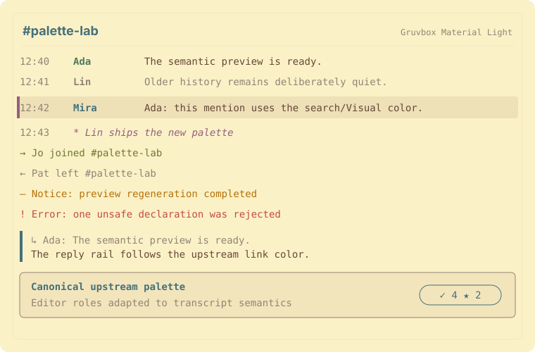
</td>
</tr></table>
<table><tr>
<td width="50%" valign="top">
<a href="github-dark/README.md"><strong>GitHub Dark</strong></a> 
<a href="github-dark/github-dark.json">JSON</a> 

</td>
<td width="50%" valign="top">
<a href="github-light/README.md"><strong>GitHub Light</strong></a> 
<a href="github-light/github-light.json">JSON</a> 
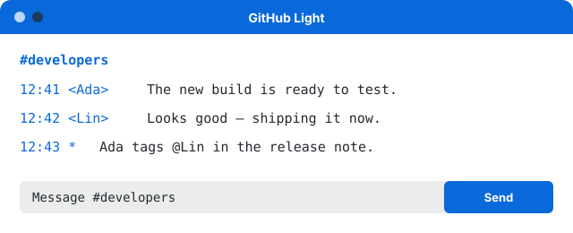
</td>
</tr></table>
<table><tr>
<td width="50%" valign="top">
<a href="oxocarbon-light/README.md"><strong>Oxocarbon Light</strong></a> 
<a href="oxocarbon-light/oxocarbon-light.json">JSON</a> 

</td>
<td width="50%" valign="top">
<a href="sonokai/README.md"><strong>Sonokai</strong></a> 
<a href="sonokai/sonokai.json">JSON</a> 

</td>
</tr></table>
<table><tr>
<td width="50%" valign="top">
<a href="edge-dark/README.md"><strong>Edge Dark</strong></a> 
<a href="edge-dark/edge-dark.json">JSON</a> 

</td>
<td width="50%" valign="top">
<a href="edge-light/README.md"><strong>Edge Light</strong></a> 
<a href="edge-light/edge-light.json">JSON</a> 

</td>
</tr></table>
<table><tr>
<td width="50%" valign="top">
<a href="moonfly/README.md"><strong>Moonfly</strong></a> 
<a href="moonfly/moonfly.json">JSON</a> 

</td>
<td width="50%" valign="top">
<a href="bamboo/README.md"><strong>Bamboo</strong></a> 
<a href="bamboo/bamboo.json">JSON</a> 

</td>
</tr></table>
<table><tr>
<td width="50%" valign="top">
<a href="melange/README.md"><strong>Mélange</strong></a> 
<a href="melange/melange.json">JSON</a> 

</td>
<td width="50%" valign="top">
<a href="cyberdream/README.md"><strong>Cyberdream</strong></a> 
<a href="cyberdream/cyberdream.json">JSON</a> 

</td>
</tr></table>
<table><tr>
<td width="50%" valign="top">
<a href="vscode-dark/README.md"><strong>VSCode Dark+</strong></a> 
<a href="vscode-dark/vscode-dark.json">JSON</a> 
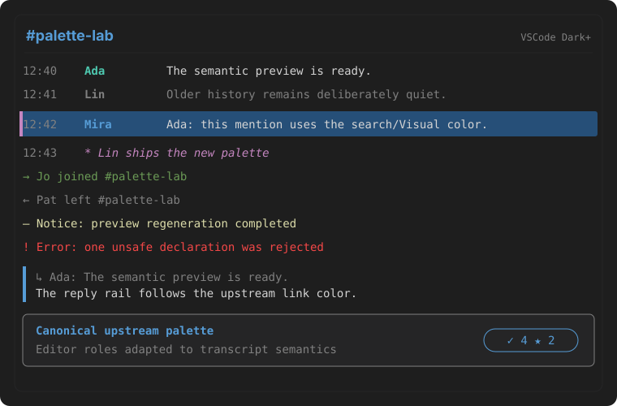
</td>
<td width="50%" valign="top">
<a href="vscode-light/README.md"><strong>VSCode Light+</strong></a> 
<a href="vscode-light/vscode-light.json">JSON</a> 
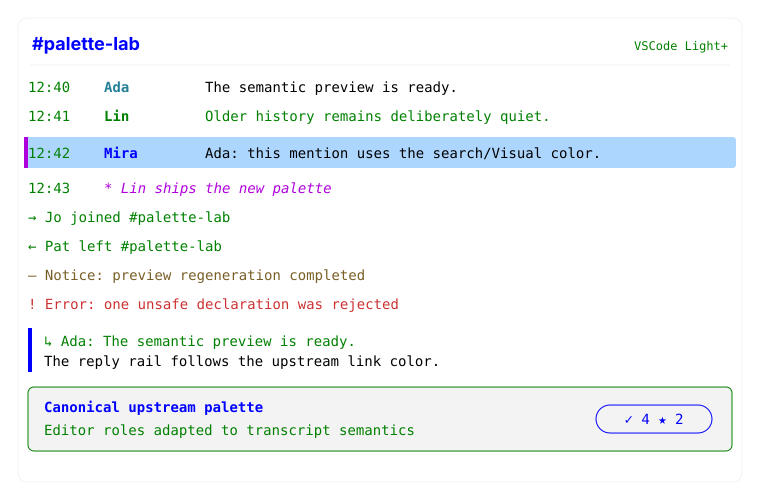
</td>
</tr></table>
<table><tr>
<td width="50%" valign="top">
<a href="solarized-osaka/README.md"><strong>Solarized Osaka</strong></a> 
<a href="solarized-osaka/solarized-osaka.json">JSON</a> 

</td>
<td width="50%" valign="top">
<a href="nordic/README.md"><strong>Nordic</strong></a> 
<a href="nordic/nordic.json">JSON</a> 

</td>
</tr></table>
<table><tr>
<td width="50%" valign="top">
<a href="tokyodark/README.md"><strong>Tokyo Dark</strong></a> 
<a href="tokyodark/tokyodark.json">JSON</a> 
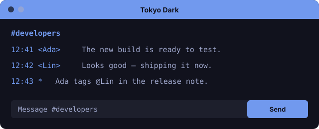
</td>
<td width="50%" valign="top">
<a href="material-darker/README.md"><strong>Material Darker</strong></a> 
<a href="material-darker/material-darker.json">JSON</a> 

</td>
</tr></table>
<table><tr>
<td width="50%" valign="top">
<a href="shades-of-purple/README.md"><strong>Shades of Purple</strong></a> 
<a href="shades-of-purple/shades-of-purple.json">JSON</a> 
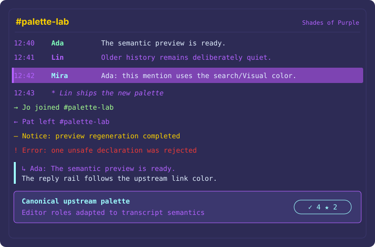
</td>
<td width="50%" valign="top">
<a href="onehalf-dark/README.md"><strong>One Half Dark</strong></a> 
<a href="onehalf-dark/onehalf-dark.json">JSON</a> 
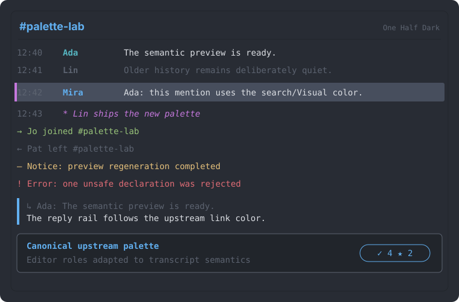
</td>
</tr></table>
<table><tr>
<td width="50%" valign="top">
<a href="onehalf-light/README.md"><strong>One Half Light</strong></a> 
<a href="onehalf-light/onehalf-light.json">JSON</a> 
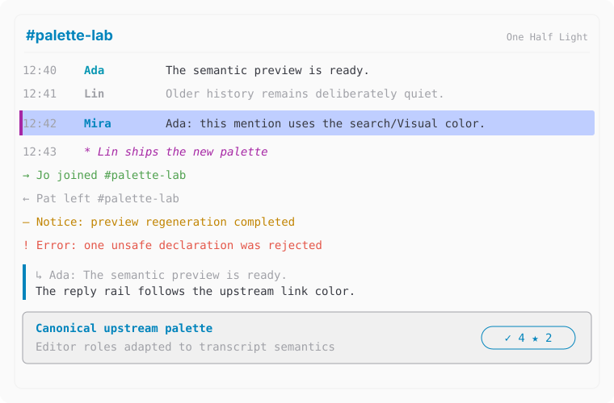
</td>
<td width="50%" valign="top">
<a href="base16-default-dark/README.md"><strong>Base16 Default Dark</strong></a> 
<a href="base16-default-dark/base16-default-dark.json">JSON</a> 

</td>
</tr></table>
<table><tr>
<td width="50%" valign="top">
<a href="base16-default-light/README.md"><strong>Base16 Default Light</strong></a> 
<a href="base16-default-light/base16-default-light.json">JSON</a> 
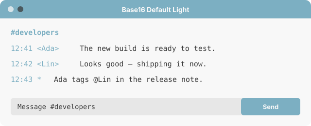
</td>
</tr></table>

## Adaptation policy

- `background` follows the upstream editor or Normal background.
- `text` follows the upstream primary foreground.
- `accent` uses a representative upstream blue, purple, yellow, or other
  principal highlight rather than inventing a new color.
- `appearance` follows the upstream variant.
- `customCSS` is empty because these are palette-only adaptations.
- IDs are deterministic UUIDs derived from the catalog slug, so regeneration
  does not silently create new identities.

## Duplicate policy

Schemes are duplicates when all four imported visual values—appearance,
background, text, and accent—are identical. Only the higher-ranked source is
retained:

- `onedarkpro` collapsed to the same export as `onedark`; OneDark is retained
  because its family ranks above OneDarkPro in the cited Dotfyle catalog.
- dark `oxocarbon` collapsed to the same export as `carbonfox`; Carbonfox is
  retained because its Nightfox family ranks above Oxocarbon there.
- Oxocarbon Light remains because it has a distinct exported palette.

The automated tests reject any future duplicate visual tuple.

Run `node colorschemes/scripts/generate-catalog.js` from the repository root
after changing the reviewed catalog data.
