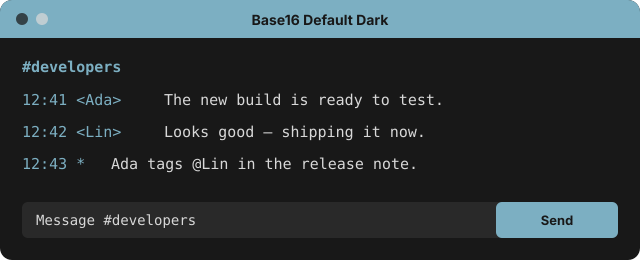

# Base16 Default Dark

A transcript-aware bIRC adaptation of [Base16 Default Dark](https://github.com/chriskempson/base16-vim).

The SVG is generated from the same semantic palette and CSS embedded in
the import file. It demonstrates transcript states rather than imitating
bIRC's native window chrome.

## Semantic mapping

| bIRC transcript role | Upstream intent | Color |
| --- | --- | --- |
| Canvas | Normal/editor background | `#181818` |
| Ordinary text | Normal/editor foreground | `#d8d8d8` |
| Native accent | Principal upstream highlight (blue) | `#7cafc2` |
| Timestamps and history | Comment/muted foreground | `#585858` |
| Links, replies, and card titles | Link/function/blue | `#7cafc2` |
| Joins | String/diff-added/green | `#a1b56c` |
| Parts and quits | Comment/muted foreground | `#585858` |
| Notices | Warning/yellow | `#f7ca88` |
| Actions | Special/magenta | `#ba8baf` |
| Errors and kicks | Error/red | `#ab4642` |
| Modes, nicks, topics, and server lines | Type/cyan | `#86c1b9` |
| Mention background | Search/Visual/selection | `#383838` |
| Cards and reaction surfaces | Secondary editor surface | `#282828` |

The native JSON fields retain the upstream canvas, foreground, principal
accent, and light/dark appearance. `customCSS` supplies the additional
transcript distinctions using only selectors and visual properties listed
in bIRC's Custom transcript CSS documentation.

## Upstream evidence

- Canonical Vim/Neovim source: [https://github.com/chriskempson/base16-vim](https://github.com/chriskempson/base16-vim)
- Palette evidence: `colors/base16-default-dark.vim`
- Upstream license: `MIT`

The upstream project remains authoritative for its palette, variants,
name, and license. This adaptation contains independently generated bIRC
configuration and preview data, not copied Vim or Neovim implementation
code.
