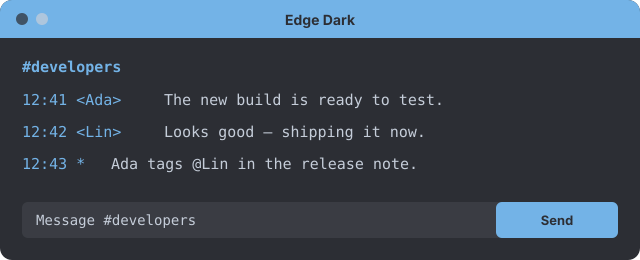

# Edge Dark

A transcript-aware bIRC adaptation of [Edge Dark](https://github.com/sainnhe/edge).

The SVG is generated from the same semantic palette and CSS embedded in
the import file. It demonstrates transcript states rather than imitating
bIRC's native window chrome.

## Semantic mapping

| bIRC transcript role | Upstream intent | Color |
| --- | --- | --- |
| Canvas | Normal/editor background | `#2c2e34` |
| Ordinary text | Normal/editor foreground | `#c5cdd9` |
| Native accent | Principal upstream highlight (blue) | `#6cb6eb` |
| Timestamps and history | Comment/muted foreground | `#758094` |
| Links, replies, and card titles | Link/function/blue | `#6cb6eb` |
| Joins | String/diff-added/green | `#a0c980` |
| Parts and quits | Comment/muted foreground | `#758094` |
| Notices | Warning/yellow | `#deb974` |
| Actions | Special/magenta | `#d38aea` |
| Errors and kicks | Error/red | `#ec7279` |
| Modes, nicks, topics, and server lines | Type/cyan | `#5dbbc1` |
| Mention background | Search/Visual/selection | `#3b3e48` |
| Cards and reaction surfaces | Secondary editor surface | `#363944` |

The native JSON fields retain the upstream canvas, foreground, principal
accent, and light/dark appearance. `customCSS` supplies the additional
transcript distinctions using only selectors and visual properties listed
in bIRC's Custom transcript CSS documentation.

## Upstream evidence

- Canonical Vim/Neovim source: [https://github.com/sainnhe/edge](https://github.com/sainnhe/edge)
- Palette evidence: `colors/edge.vim default dark`
- Upstream license: `MIT`

The upstream project remains authoritative for its palette, variants,
name, and license. This adaptation contains independently generated bIRC
configuration and preview data, not copied Vim or Neovim implementation
code.
