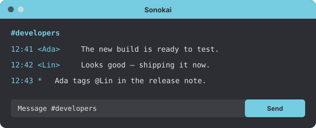

# Sonokai

A bIRC colorscheme adapted from [Sonokai](https://github.com/sainnhe/sonokai).

The preview is illustrative: actual typography, spacing, and interface
chrome are controlled by bIRC. The three colors match the JSON exactly.

## Mapping

- Appearance: `dark`
- Background: `#2c2e34`
- Text: `#e2e2e3`
- Accent: `#76cce0`
- Palette basis: Sonokai default background, foreground, and blue.

The original editor theme has many syntax and interface colors. bIRC's
export format has one background, one text color, and one accent, so this
adaptation preserves the upstream Normal/editor canvas and chooses a
representative upstream highlight color for the accent.

## Upstream

- Canonical Vim/Neovim source: [https://github.com/sainnhe/sonokai](https://github.com/sainnhe/sonokai)
- Upstream license: `MIT`

The upstream project remains the authority for its name, palette, license,
variants, and current maintenance status. This directory contains only a
small interoperable palette adaptation, not upstream Vim or Neovim code.
